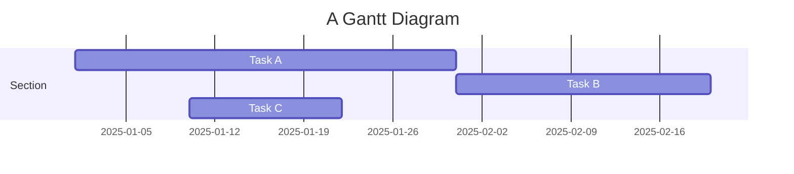
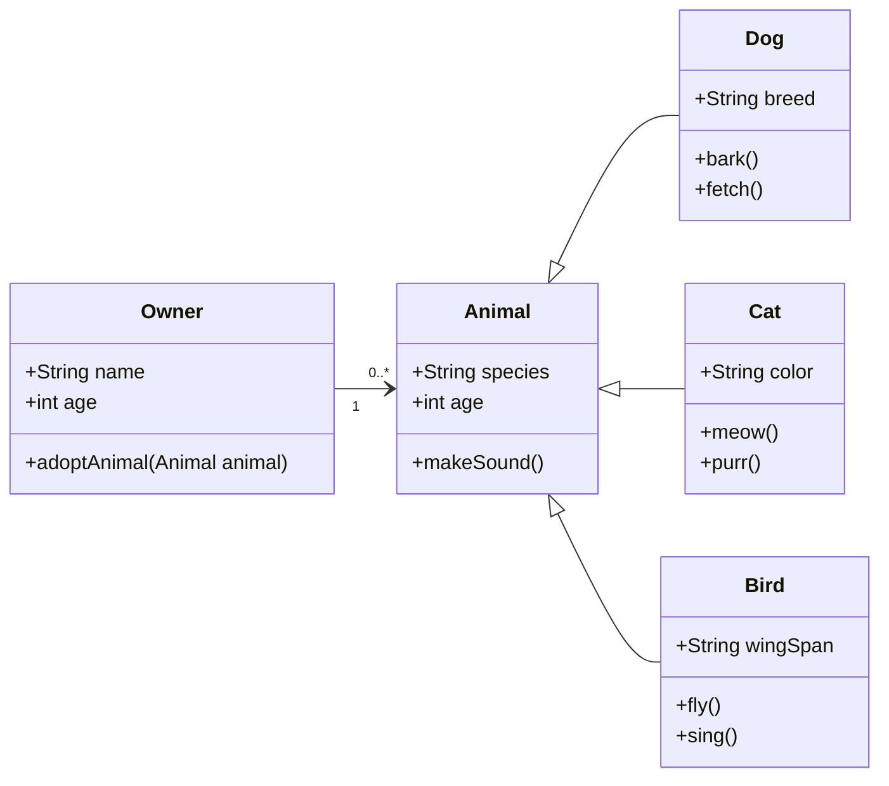

## Introduction
s
Since the introduction of the Transformer architecture, large language models have leveraged tens to hundreds of billions of parameters to achieve remarkable language generation capabilities. However, such massive model scales dramatically increase cloud operating costs, GPU memory requirements, and power consumption, making real-world deployment and low-power edge use difficult. To mitigate these challenges, 8-bit and 4-bit quantization techniques have been adopted to reduce memory usage with minimal performance loss compared to FP16, but when bit-width is reduced below 2 bits, both perplexity and zero-shot accuracy suffer drastic degradation.


Extreme 1-bit quantization offers the potential to reduce storage and bandwidth requirements by up to 32×[^2], but to offset the information loss from lower bit-widths, the model must be scaled up significantly. Conversely, an overly large model diminishes the gains in memory and compute reduction, so identifying the “optimal model size” that maintains FP16-level performance while still achieving efficient resource savings is essential.

In particular, PTQ (Post-Training Quantization) and QAT (Quantization-Aware Training) require very different model scales, yet to date no study has quantitatively defined the optimal sizes for these two approaches. In this work, we conduct a thorough survey of the leading 1-bit training methods published since 2023 and experimentally determine the PTQ- and QAT-optimized model scales, providing concrete guidelines for balancing target performance and resource constraints when designing and deploying 1-bit LLMs.
[^2]: Rastegari et al. (2016). “XNOR-Net: ImageNet Classification Using Binary Convolutional Neural Networks.” ECCV.
---

## Related work about quantization method (1-bit or sub 1-bit)

### PTQ vs QAT
### BitNet
This was the first study to introduce QAT to a 1-bit LLM. In that paper, the authors proposed a scalable and stable 1-bit Transformer architecture and, in particular, introduced BitLinear, a 1-bit weight layer that can replace the standard fully connected layer.

BitNet retains the familiar Transformer stacking of self-attention and feed-forward blocks, but replaces all weight matrix multiplications with BitLinear, which uses 1-bit weights. All other operations—including residual connections and LayerNorm—remain in 8-bit precision. This design choice is justified because (1) residual paths and LayerNorm incur only negligible compute and memory cost compared to the core Transformer operations, and (2) high-precision probabilities are required for accurate sampling.

1. **Weight Binarization**  
   First, the weight \(W\) is binarized to \(\{+1, -1\}\) via a sign function.  
   To zero-center the weights, subtract the mean \(\alpha\), then use the scale factor \(\alpha\) to minimize the binarization error.  
   
   $$
   \alpha = \frac{1}{nm} \sum_{i,j} W_{ij},  
   \quad  
   \widetilde{W} = \operatorname{Sign}(W - \alpha),  
   \quad  
   \operatorname{Sign}(x) =  
   \begin{cases}  
     +1, & x > 0,\\  
     -1, & x \le 0.  
   \end{cases}  
   $$

2. **Activation AbsMax Quantization**  
   The activation \(x\) is quantized to \(b\) bits.  
   
   $$
   \widetilde{x} = \mathrm{Quant}(x) 
     = \mathrm{Clip}\!\Bigl(x \times \tfrac{Q_b}{\gamma},\,-Q_b + \epsilon,\;Q_b - \epsilon\Bigr),  
   \\  
   \mathrm{Clip}(z,a,b) = \max\!\bigl(a,\min(b,z)\bigr),  
   \quad  
   \gamma = \|x\|_\infty.
   $$

   Then, subtract the minimum \(\eta = \min_{i,j} x_{ij}\) from all values to shift into a fixed positive range, and apply the same quantization:

   $$
   \widetilde{x} = \mathrm{Quant}(x) 
     = \mathrm{Clip}\!\Bigl((x - \eta)\times \tfrac{Q_b}{\gamma},\,-Q_b+\epsilon,\;Q_b-\epsilon\Bigr),  
   \quad  
   \eta = \min_{i,j} x_{ij}.
   $$

3. **Matrix Multiplication**  
   Perform matrix multiplication using the binarized weight \(\widetilde{W}\) and the quantized activation \(\widetilde{x}\):

   $$
   y = \widetilde{W}\,\widetilde{x}.
   $$

4. **LayerNorm for Variance Preservation**  
   To ensure the output variance \(\mathrm{Var}(y)\approx 1\), apply LayerNorm before activation quantization.  
   Using Sub-LayerNorm and the aforementioned quantization methods, the BitLinear layer is defined as:

   $$
   \begin{aligned}
     y &= \widetilde{W}\,\mathrm{Quant}\bigl(\mathrm{LN}(x)\bigr)\times \frac{\beta\,\gamma}{Q_b},\\
     \mathrm{LN}(x) &= \frac{x - \mathbb{E}[x]}{\sqrt{\mathrm{Var}(x) + \epsilon}},  
     \quad  
     \beta = \frac{1}{nm}\|W\|_{1}.
   \end{aligned}
   $$
### Sub 1-bit

---

## Methodology for Finding the Optimal Model Size

Earlier, we emphasized that pinpointing the “optimal model size” that preserves FP16-level performance while maximizing resource savings is essential. In practice, however, we face several hurdles:
1. Heterogeneity of Datasets and Evaluation Metrics
- Different papers use varied zero-shot benchmarks (ARC, HellaSwag, WinoGrande, etc.) and evaluation metrics, and even on the same benchmark the baseline accuracy can differ widely, making simple averages misleading.
2. Incompleteness in the Perplexity Perspective
- Some methods report better PPL than the FP16 baseline at smaller scales, while other studies simply do not provide PPL data below a certain size, resulting in incomplete comparisons.

To overcome these challenges, our study successfully quantifies the optimal model scales through the following procedure:
### Zero-shot Accuracy Perspective
1. Extracting the 90% Threshold
- For each paper and zero-shot benchmark, we determine the minimum model size required to reach 90% of the FP16 baseline accuracy.
2. Adjusting for Under-Reporting
- If even the largest reported scale fails to hit 90%, we multiply that maximum scale by 1.5 to estimate the required size (e.g., if a 3B model falls short, we assume 4.5B would meet the threshold).
3. Averaging
- We first average the required scales across shared benchmarks (ARC, HellaSwag, etc.), then compute separate averages for PTQ and QAT to obtain representative values.

### Perplexity Perspective
1. Establishing a PPL ≤ 10 Criterion
- Because some methods exceed the baseline PPL and others omit data, we set a consistent standard of PPL ≤ 10.
2. Collecting Required Scales
- We gather the model sizes reported for PTQ and QAT methods that satisfy the PPL ≤ 10 criterion.
3. Averaging
- We average these scales separately for PTQ and QAT, yielding comparable insights between the two approaches.

### Seperation for PTQ vs QAT
PTQ and QAT demand significantly different optimal model sizes, so it is necessary to quantify each quantization approach’s optimal scale independently.


---

## Results


---

## Conclusion

You can add interative plots using plotly + iframes :framed_picture:


---

## Details boxes


---

## Mermaid

This theme supports creating diagrams directly in markdown using [Mermaid](https://mermaid.js.org/). 




It will be presented as:



With Mermaid, you can easily add clear and dynamic diagrams to enhance your blog content.

---

## Diff2Html


## Leaflet


## Chartjs, Echarts and Vega-Lite


---

## TikZ


---

## Typograms

[Typograms](https://google.github.io/typograms/) are a way of combining text and g

## Layouts

T

---

## Other Typography?


Here's our logo (hover to see the title text):

Inline-style:


Reference-style:
![alt text][logo]

[logo]: https://github.com/adam-p/markdown-here/raw/master/src/common/images/icon48.png "Logo Title Text 2"


```
No language indicated, so no syntax highlighting.
But let's throw in a <b>tag</b>.
```

Colons can be used to align columns.

| Tables        |      Are      |  Cool |
| ------------- | :-----------: | ----: |
| col 3 is      | right-aligned | $1600 |
| col 2 is      |   centered    |   $12 |
| zebra stripes |   are neat    |    $1 |

There must be at least 3 dashes separating each header cell.
The outer pipes (|) are optional, and you don't need to make the
raw Markdown line up prettily. You can also use inline Markdown.

| Markdown | Less      | Pretty     |
| -------- | --------- | ---------- |
| _Still_  | `renders` | **nicely** |
| 1        | 2         | 3          |

> Blockquotes are very handy in email to emulate reply text.
> This line is part of the same quote.

Quote break.

> This is a very long line that will still be quoted properly when it wraps. Oh boy let's keep writing to make sure this is long enough to actually wrap for everyone. Oh, you can _put_ **Markdown** into a blockquote.

Here's a line for us to start with.

This line is separated from the one above by two newlines, so it will be a _separate paragraph_.

This line is also a separate paragraph, but...
This line is only separated by a single newline, so it's a separate line in the _same paragraph_.
